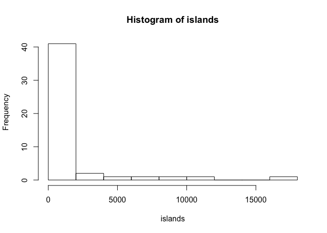

Learn RMarkdown
================
Jingkang Zhao
07 October, 2019

``` r
3*pi
```

    ## [1] 9.424778

``` r
print("learning r markdown!")
```

    ## [1] "learning r markdown!"

``` r
hist(islands)
```

<!-- -->
